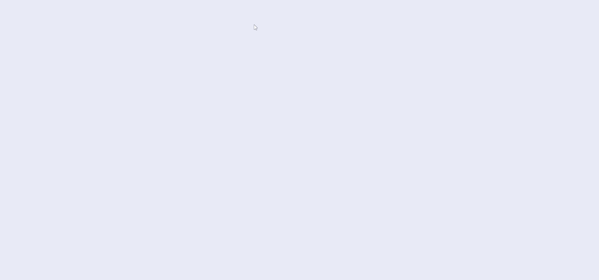
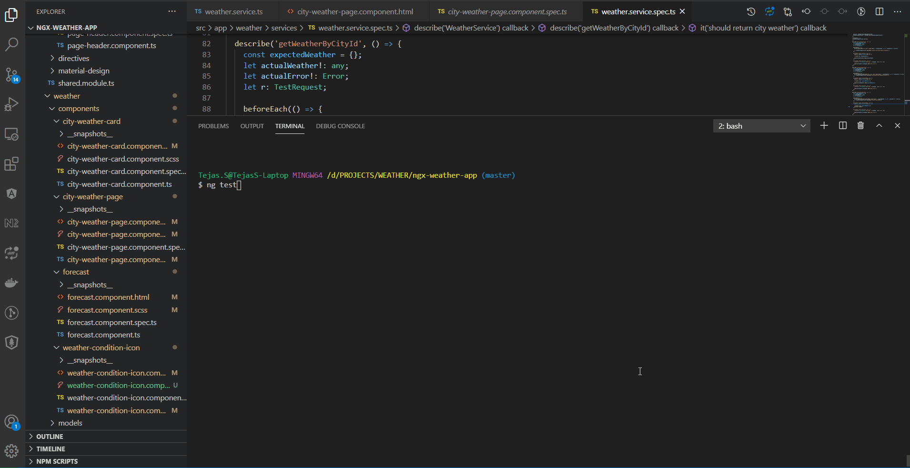

# NgxWeatherApp

This web application based on Angular 10 version, which represents a weather of European cities.
- The First page shows the list of 5 European City with brief information of current weather, displayin in Card.
- When you clicking on a Card, it navigates to another page, which displays a weather forecast for next 5 days for the selected city.

## Application Demo
### [https://ngx-weather.netlify.app/](https://ngx-weather.netlify.app/?target=_blank)

## Development server

Run `ng serve` for a dev server. Navigate to `http://localhost:4200/`. The app will automatically reload if you change any of the source files.

## Running unit tests

Run `ng test` to execute the unit tests 

## Build

Run `npm run build` to build this application. The build artifacts will be stored in the `dist/` directory. Use the `npm run build:prod` flag for a production build.
